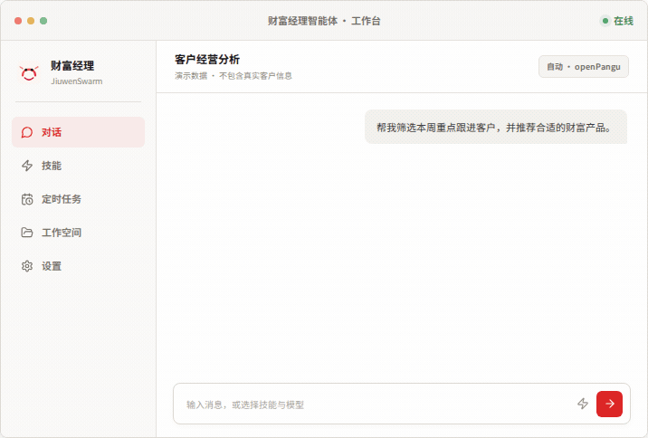

# 岗位智能体平台 / Workforce Agent Platform

面向企业岗位的智能体平台，为不同岗位配置模型、工具、频道、协作和外部 Agent 能力。

<p align="center">
  
</p>

## 适合做什么

- 给每个岗位或员工申请一个隔离的智能体实例，用于日常对话、资料处理、文件生成和任务执行。
- 统一接入 JiuwenSwarm、A2A 或自定义 HTTP Agent，前端和管理后台不需要随运行时重写。
- 把企业内部工具、MCP 服务、专业技能、岗位权限和审计记录接入一个可管理的平台。
- 做企业岗位助手、知识工作台、客户经营助手、运营审核助手、办公自动化和团队协作类原型。

推荐默认部署形态：

```text
浏览器 / iOS 壳
  -> 岗位智能体平台 Web 服务 (React + Node.js)
  -> JiuwenSwarm / A2A / HTTP Runtime Adapter
  -> 本机 workspace / sandbox / tools
  -> MySQL
```

## 核心亮点

**按岗位配置智能体**

每个岗位或用户可以申请自己的智能体实例。实例有独立身份、工作区、技能配置、工具权限和会话历史，适合企业内按岗位、人员或团队逐步放开。

**多 Agent Runtime 接入**

平台支持 JiuwenSwarm、A2A 和自定义 HTTP runtime。平台侧负责用户、岗位、技能市场、MCP 授权、审计和协作；运行时侧负责模型推理、工具调用和文件执行。当前企业岗位智能体推荐优先使用 JiuwenSwarm，外部专业 Agent 推荐通过 A2A/HTTP 接入。

**更顺滑的主对话体验**

主对话已做流式稳定性和前端渲染优化：流式 watchdog、断线兜底、流结束历史对账、稳定 React key、passive scroll、tab 保活、输入法防误发、图片粘贴压缩、Markdown 链接和图片安全过滤。

**持续学习工作方式**

智能体可以记住用户明确确认的输出偏好和稳定工作习惯；自动发现的内容需要在不同会话中重复出现后才会生效。成长记录按岗位实例隔离，支持查看、修正、忘记和关闭，实时客户数据、行情与产品状态仍通过授权工具查询。

**工具和技能可治理**

支持技能市场、私有技能、平台工具和 MCP 工具展示。工具能力可以逐步按岗位、用户或智能体授权，并同步到不同 runtime 的注册和 allowlist，适合企业从“先跑通能力”过渡到“可审计、可管控”。开源默认配置不内置真实业务 MCP 清单，工具明细优先从 MCP 服务自身的 `tools/list` 获取。

**协作和工作空间**

内置协作任务、工作空间、文件上传、历史会话、定时任务和渠道通知。前端不只是聊天框，也能承载任务工作台和团队协作工作流。

**管理和审计**

提供 `/admin` 管理入口，用于用户、智能体、技能、工具、系统状态和审计类能力的管理。适合在企业环境中做权限分配、问题排查和使用情况追踪。

## 开源默认边界

本仓库定位为平台框架，不携带具体企业的业务工具实现、真实岗位授权清单或生产环境配置。

- 默认岗位模板只包含 `general-assistant`，不默认授予业务 MCP。
- 真实业务岗位、MCP server 授权、模型选择和数据权限说明建议放在部署环境外部文件中，并通过 `ROLE_SKILL_MCP_BASELINE_PATH` 指向。
- 外部 baseline 可用 `skillRequirements.<skillId>.servers` 声明技能依赖的 MCP server 与工具名；它只用于运行前就绪检查，不替代岗位授权和 MCP 自身的数据权限校验。
- 业务 MCP 服务应部署在运行环境中，EA 只读取 runtime 配置和 MCP `tools/list`，不在主仓维护内部工具清单。
- 如需发布企业内部发行版，可以在私有部署仓或配置包中叠加业务 baseline、技能包和 MCP 运行目录。

## 页面入口

```text
/              -> 首页：登录、申请岗位智能体、进入工作台
/claw/:adoptId -> 岗位智能体工作台：对话、技能、频道、成长记录、协作、工作区、定时任务
/admin         -> 管理后台：智能体、组织协作、技能市场、系统设置、审计和统计
/login         -> 登录 / 注册
```

## 技术栈

| 层级 | 技术 |
|---|---|
| 前端 | React 19, Vite, TailwindCSS 4, Radix UI, tRPC |
| 后端 | Node.js 22, Express, tRPC, tsx |
| 数据库 | MySQL 8.0, Drizzle ORM |
| 运行时 | JiuwenSwarm；A2A；HTTP Adapter 可选 |
| 进程管理 | PM2 |

## 快速部署

推荐系统：Ubuntu 22.04+ / 24.04。

默认岗位运行时采用 JiuwenSwarm，一键脚本会自动安装平台及所需组件：

```bash
curl -fsSL https://linggan.top/install.sh | bash
```

脚本会自动完成：

- 安装 Node.js 22、Python、pnpm、PM2、MySQL 和 Docker
- 从 AtomGit 拉取 `linggan_ai/employee-agent`
- 安装基于官方 0.2.3 的固定版 EA JiuwenSwarm Runtime
- 生成 `.env`
- 创建数据库、执行迁移并生成管理员
- 执行 `pnpm check` 和 `pnpm build`
- 用 PM2 启动 EA、AgentServer 和 Gateway，并配置开机启动

管理员随机密码保存在安装目录的 `.bootstrap-admin-password`，权限为 `600`。首次对话前，登录管理后台的
“系统设置”，分别测试并保存 Agent 模型和 EA 平台模型。

服务默认只监听 `127.0.0.1:5180`。生产环境应通过 Nginx/WAF 提供 HTTPS；本机检查可打开：

```text
http://127.0.0.1:5180
```

确需临时直连时可显式设置 `APP_BIND_IP=0.0.0.0`，但不要在公网生产环境绕过 HTTPS 反向代理。

## 可审计安装

如果希望先检查脚本：

```bash
curl -fsSL -o /tmp/employee-agent-install.sh https://linggan.top/install.sh
less /tmp/employee-agent-install.sh
bash /tmp/employee-agent-install.sh --host 你的服务器IP
```

常用参数：

```bash
bash /tmp/employee-agent-install.sh \
  --repo https://atomgit.com/linggan_ai/employee-agent.git \
  --ref 88a11b9d661a103f05ec225d2abe9368d1ae481a \
  --expected-commit 88a11b9d661a103f05ec225d2abe9368d1ae481a \
  --mirror auto \
  --dir "$HOME/employee-agent" \
  --host your-server-ip \
  --port 5180
```

| 参数 | 说明 |
|---|---|
| `--repo <url>` | Git 仓库地址，默认 AtomGit 国内镜像 |
| `--ref <tag-or-commit>` | 固定版本标签或提交，默认使用已审计提交 |
| `--expected-commit <sha>` | 校验外部源码最终提交 |
| `--local-source` | 直接安装当前检出的代码，不再获取外部源码 |
| `--dir <path>` | 安装目录，默认 `$HOME/employee-agent` |
| `--port <port>` | 服务端口，默认 `5180` |
| `--host <ip-or-host>` | 用于生成 `FRONTEND_URL`，不传则自动探测 |
| `--db-mode <mode>` | `mysql-auto` / `existing` / `compose`，默认 `mysql-auto` |
| `--skip-mysql` | 不安装 MySQL，适合使用外部数据库 |
| `--skip-start` | 只拉代码和初始化，不构建/启动 |
| `--overwrite-env` | 已存在 `.env` 时强制重建 |
| `--dry-run` | 只打印将执行的动作 |

## 许可证

[MIT](LICENSE)
